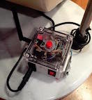

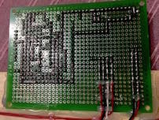
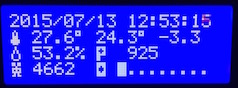
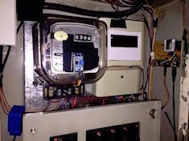
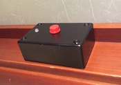
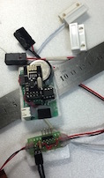
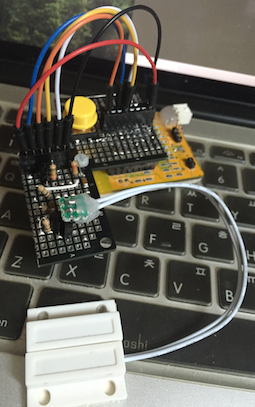

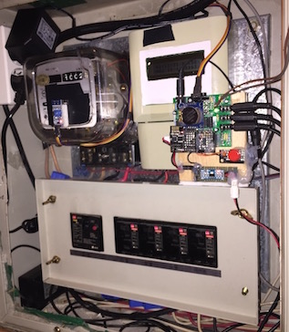
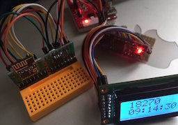
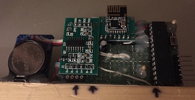
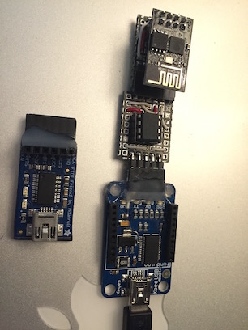
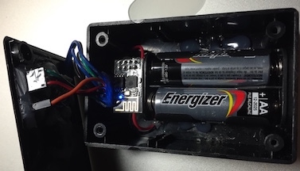

* ESP8266 mqtt node

#### Server ####
- mqtt broker : mosquitto
- db : influxdb
- web : grafana, node-red
- collect : mqtt2graphite
- alert : mqttwarn
- control : slack + rtmbot
- define MQTT_MAX_PACKET_SIZE 350

### IDE ###
- CURRENT : Arduino 1.6.7 with git version of https://github.com/esp8266/Arduino
- OLD : s1.6.4 ~ 1.65 with board manager 1.6.5 ~ 2.0.0 esp8266/Arduino

### Library ###
- https://github.com/knolleary/pubsubclient
- https://github.com/milesburton/Arduino-Temperature-Control-Library
- https://github.com/chaeplin/PietteTech_DHT-8266
- https://github.com/bogde/HX711
- https://github.com/Makuna/Rtc
- LiquidCrystal_I2C.h
- https://github.com/openenergymonitor/EmonLib
- https://github.com/bblanchon/ArduinoJson
- https://github.com/MajenkoLibraries/Average
- https://github.com/Yveaux/arduino_vcc
- https://github.com/PaulStoffregen/Time
- https://github.com/z3t0/Arduino-IRremote
- https://github.com/JChristensen/Timer

| name | esp | arduino | desc |
|------|-----|---------|------|
| _01-door-alarm | esp-12 | pro mini | alarm door status using mqtt. first one to learn esp, didn't know how to wake up esp using external intterupt. replaced with _06-power_meter. check _15-esp8266-dash-deepsleep-reset and _48-door-alarm-deepsleep for latest | 
| _02-mqtt-sw-temperature | esp-12 | | control lamp, pub temp, pub radio data. nrf24l01P |
| _03-hx711-scale | esp-12 | pro mini | pub measured weight of pet. hx711, 4 * body scale load cell |
| _04-lcd-dust | esp-01 | nano | display mqtt msg, pub temp/hum, dust, control ir |
| _05-two-ds18b20 | esp-12 | | pub temp. ds18b20. to check deepsleep and life of 2 * AA battery |
| _06-power_meter | esp-12 | | pub power usage, door status. using CT sensor and ADC ---> replaced by _49-emontxv2-esp-01-i2c|
| _07-ac-ir-remote-timer | | pro mini | |
| _08_hc-sr04 | | | hc-sr04 test |
| _09_ir_tx_rx | | nano | to control tv using ir |
| _10-syslog | esp | | udp/syslog example |
| _11-mqtt-lwt-test | esp | | mqtt lwy test |
| _12-wifiscan | esp | | wifi scan test |
| _13-mfrc522-esp8266 | esp | | rfid mfrc522 test |
| _14-mqtt-reconnect-with-reset | esp | | |
| _15-esp8266-dash-deepsleep-reset | esp | | to coltrol lamp. dash like button |
| _16-mqtt-pub-100ms-50ms | esp | | pub test |
| _17-two-esp-one-pub-50ms-one-sub-pub-50ms | esp | | pub test |
| _18-adc-test-using-sdk-1.5| esp | | adc test |
| _19-wifi-test-using-sdk-1.5| esp | | wifi test |
| _20-esp8266-dash-deepsleep-test | esp | | test of _15-esp8266-dash-deepsleep-reset |
| _21-sntp | esp | | sntp test |
| _22-CheckFlashConfig | esp | | CheckFlashConfig |
| _23-attiny85-ir | | tiny85 | ir tx test |
| _24-attiny85-wdt-sleep | | tiny85 | sleep test |
| _25-attiny85-nrf24-ds18b20 | | tiny85 | temp sensor |
| _26-attiny85-nrf24-pin-change-int | | tiny85 | pc int test |
| _27-attiny85-two-85-boost | | tiny85 | distance test |
| _28-attiny85-nrf24-3pin-ir | | tiny85 | distance using ir. checking toilet paper roll |
| _29-attiny85-nrf24-5pin-pin-change-int | | tiny85 | check door bell |
| _30-attiny85-nrf24-5pin-pin-change-int | | tiny85 | check door bell. last one |
| _31-esp-12-gps-ntpd | esp | | gps + ntpd test |
| _32-esp-12-BasicOTA | esp | | ota test |
| _33-esp-12-WiFiClientSecure-mqtt-ssl | esp | | mqtt tlsv1.1 with ip |
| _34-esp-12-WiFiClientSecure-mqtt-ssl-using-dns | esp | | mqtt tlsv1.1 with name |
| _35-esp-12-wpa2-enterprise | esp | | wpa2-enterprise  |
| _36-esp-rtc-mem-test | esp | | rtc mem test |
| _37-wifi-off-modem-sleep | esp | | modem off test |
| _38-wifi-off-light-sleep | esp | | light sleep test |
| _39_esp12-random-test | esp | | random number gen |
| _40_esp12-random-test-udp-report | esp | | random number gen |
| _41-promini-nrf24-ads1115 | | pro mini | i2c adc ads1115 |
| _42-promini-nrf24-32byte | | pro mini | nrf24 32byte test|
| _43-PietteTech_DHT-8266 | esp | | interrup driven dht22 test |
| _44-esp-atmega328p-spi | esp | atmega328p | spi multi byte test |
| _45-esp-atmega328p-i2c | esp | atmega328p | i2c multi byte test |
| _46-esp-atmega328p-spi-i2c | esp | atmega328p | spi and i2c multi byte test |
| _47-esp-dht22-2AA-deepsleep-test | esp | | dht22 test |
| _48-door-alarm-deepsleep | esp | | | door alarm using reed switch |
| _49-emontxv2-esp-01-i2c | esp-01 | atmega328p | emontx v2 plus esp-01 and ds1307. test | 
| _50-promini-nrf24-getntp | | pro mini | nrf24 ntp test |
| _51-attiny85-nrf24-lcd-getntp | | tiny85 | tiny85 spi and i2c mixing |
| _52-attiny85-hx711-nrf24-deprecated | | tiny85 | nrf24 / hx711 / gy-521 test, flash is small |
| _53-esp-01-i2c-lcd | esp-01 | | i2c lcd test |
| _54-atmega328p-nrf24-gy-521-hx711 | | atmega328p | second version of sacle for pet |
| _55-tiny85-dtr-control-esp8266 | | tiny85 | auto reset on Xbee programmer |
| _56-gopro-control | esp-01 | | 4M flash version, to upload gopro picture to twitter |
| _57-tiny85-cds-pir | | tiny85 | to turn off light which has touch sensor |
| _58-esp8266-tyny85-dash-button | esp-01 | tiny85 | second version of dash button |

#### _02-mqtt-sw ####
- esp-12 + nrf24l01p
- power(5v + 3.3V), fuse(10A + 73°C thermal), 1CH relay, SW(top + lamp), PIR, DS18B20(out)
- on/off lamp using mqtt, pub temp outside/pir

#### _03-hx711-scale ####
- esp-12 +(i2c) pro mini
- hx711, load cell, tilt sw
- pub measured weight of pet

#### _04-mqtt-lcd-dust-sensor ####
- esp-01 +(i2c) nano
- lcd(i2c), rtc(i2c), level convertor, Sharp dust sensor, IR sned/recv, dht22
- display clock, temp/humidity(mqtt sub), dust
- control LG_AC using Apple remote

#### _06-power-meter ####
- esp-12
- CT sensor, line tracker
- pub power usage

### _15-esp8266-dash-deepsleep-reset ###
- esp-12
- dash like button
- to control lamp sw

#### _29-attiny85-nrf24-5pin-pin-change-int / _30-attiny85-nrf24-5pin-pin-change-int ####
- attiny 85 + nrf24l01p
- optical isolator
- for door bell
- _30-attiny85-nrf24-5pin-pin-change-int is last one using gammon's wdt

#### _25-attiny85-nrf24-ds18b20 ####
- attiny 85 + nrf24l01p
- two ds18b20
- to check temp

#### _28-attiny85-nrf24-3pin-ir ####
- attiny 85 + nrf24l01p
- ir send and receiver
- to check roll

#### _41-promini-nrf24-ads1115 ###
- pro mini(3.3V) + nrf24l01p + µCurrent GOLD
- to report current measure 

