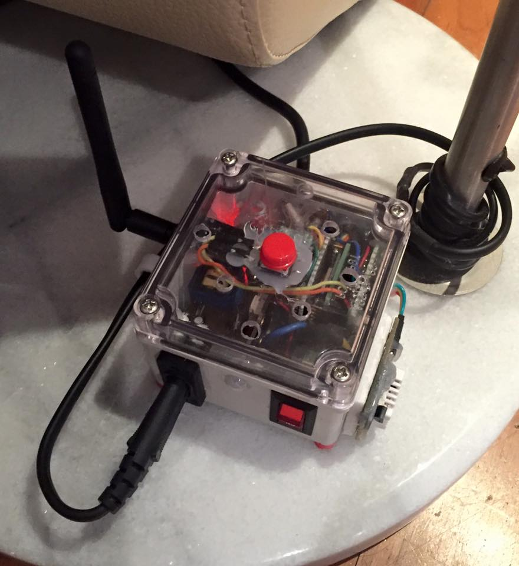

||

* ESP8266 mqtt node

#### Server ####
- mqtt broker : mosquitto
- db : influxdb
- web : grafana, node-red
- collect : mqtt2graphite
- alert : mqttwarn 

### Library ###
- https://github.com/knolleary/pubsubclient
- https://github.com/milesburton/Arduino-Temperature-Control-Library
- https://github.com/adafruit/DHT-sensor-library
- https://github.com/bogde/HX711
- https://github.com/Makuna/Rtc
- LiquidCrystal_I2C.h
- https://github.com/openenergymonitor/EmonLib
- https://github.com/bblanchon/ArduinoJson
- https://github.com/MajenkoLibraries/Average
- https://github.com/Yveaux/arduino_vcc
- https://github.com/PaulStoffregen/Time
- https://github.com/z3t0/Arduino-IRremote

#### _02-mqtt-sw ####
- esp-12
- power(5v + 3.3V), fuse(10A + 73°C thermal), 1CH relay, SW(top + lamp), PIR, DS18B20(in + out), DHT22 , NRF24L01P
- on/off lamp using mqtt, pub temp(inside of box + outside)/humidity/pir
- gateway for NRF24L01 sensors. pub to mqtt server

