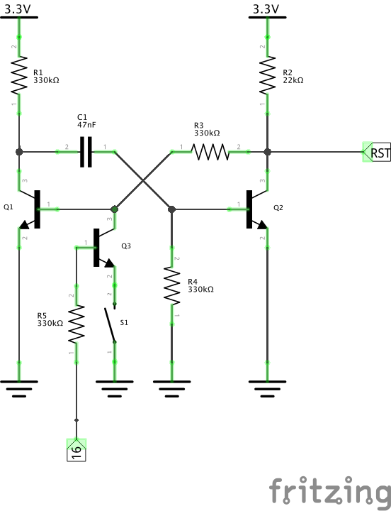
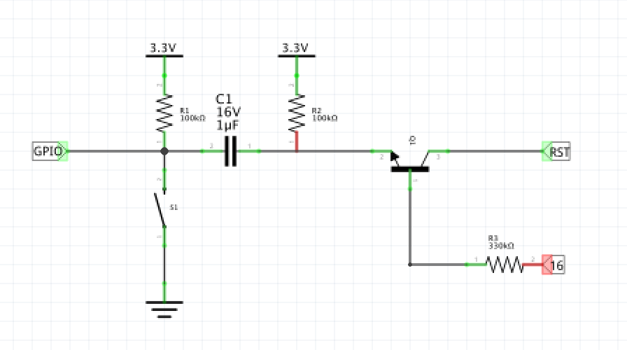
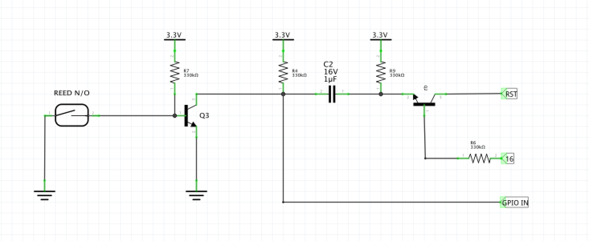
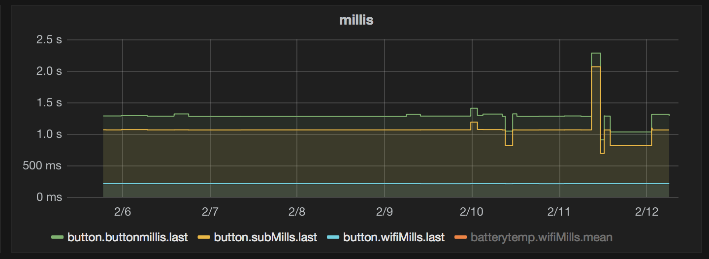
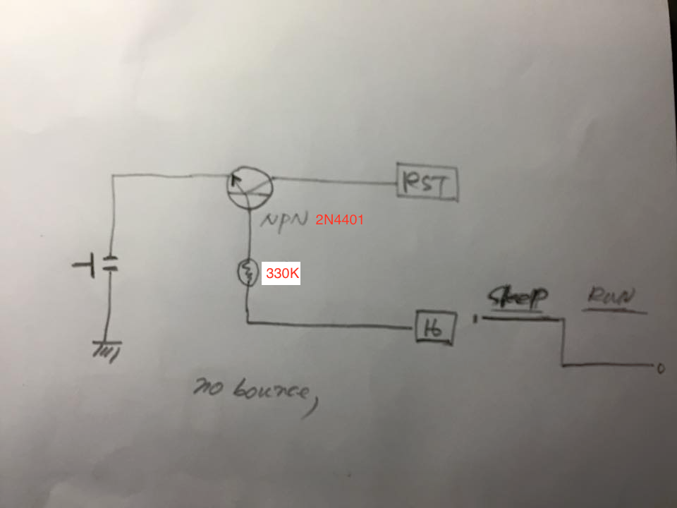

#### button using esp8266/Arduino ####

http://chaeplin.github.io/project-01-button.html

- deepSleep(0)
- Using GPIO16 and NPN TR, reset is not permitted while device is running
- Use static ip for fast WIFI connection
- 22K R is changed to 330K
- I think a sensor output to RST(monostable flip) and other GPIO can be used for interrupt triggered wake up and GPIO event monitoring.

http://www.bowdenshobbycircuits.info/page9.htm
http://www.bowdenshobbycircuits.info/mono.gif

