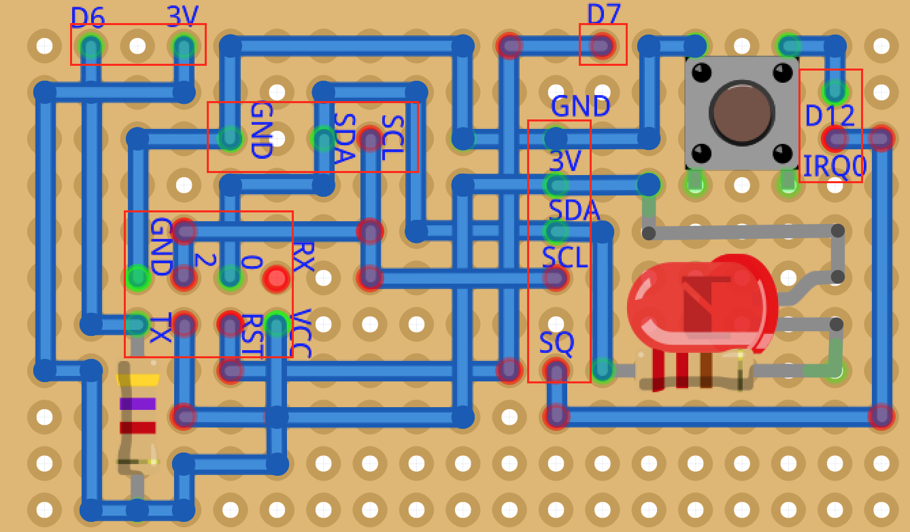
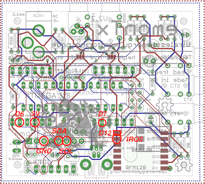
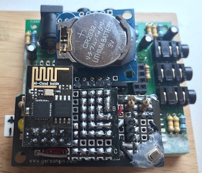
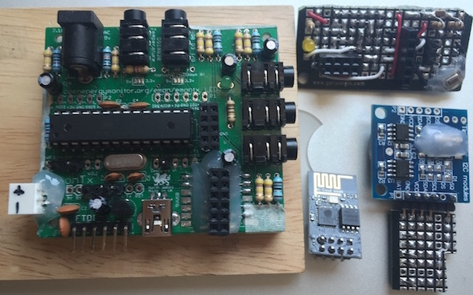
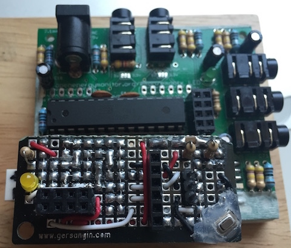
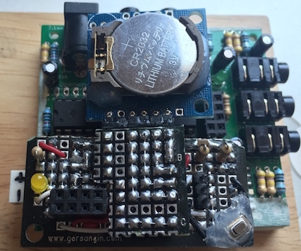

| atmega328 | esp-01 | ds1307 | ETC |
|----|----|----|----|
| 3V | 3V | 3V | |
| GND | GND | GND | |
| SCL / A5 | D2 | SCL | |
| SDA / A4 | D0 | SDA | LED / LOW WHILE FLASH ESP8266|
| IRQ0 / D2 | | SQ | LOW PULSE|
| D6 | TX | | |
| D7 | RST | | |
| D12 | | | BUTTON / LOW PULSE to FLASH |

